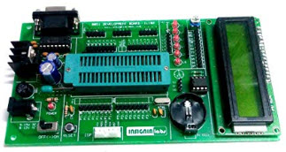
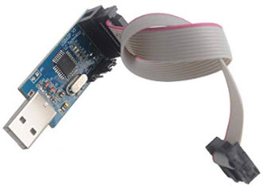
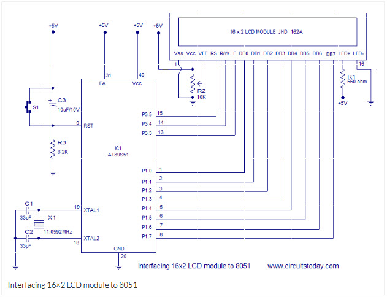
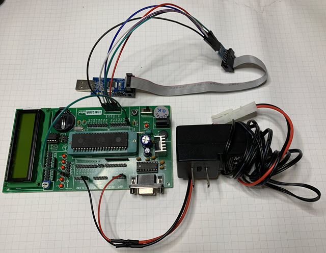

# ATMEL 8051 Development Board with JHD162A LCD and DS1307 Clock

https://www.amazon.com/gp/product/B07KKHPFDV<br>


https://www.amazon.com/gp/product/B07NZ59VK2<br>


# Links

[Board manufacturer](https://insignialabs.com/atmel-8051-development-board-with-lcd-ds1307-clock-zif-support-1806428)

[Adafruit tutorial on the LCD display](https://learn.adafruit.com/character-lcds/wiring-a-character-lcd)

[Good ebook on 8051 tech](http://ee.sharif.edu/~sakhtar3/books/mazidi/)

[8051 datasheet](https://www.keil.com/dd/docs/datashts/atmel/at89s52_ds.pdf)

[8051 opcodes](http://www.keil.com/support/man/docs/is51/is51_opcodes.htm)

[Fantastic Companion Book](https://www.amazon.com/gp/product/129202657X)

[8051 Example](http://www.circuitstoday.com/interfacing-16x2-lcd-with-8051)

# Journal

## February 20, 2020

http://www.circuitstoday.com/interfacing-16x2-lcd-with-8051



## February 17, 2020

https://github.com/arduino-libraries/LiquidCrystal/blob/master/src/LiquidCrystal.cpp


## February 15, 2020

I moved my assemblers/disassemblers to a pip project:

```
pip install opcodetools

python -m opcodetools.asm lcd.asm
```

I am using my own ISP now:

[https://github.com/topherCantrell/pi-isp](https://github.com/topherCantrell/pi-isp)


## February 2, 2020

I got my "The 8051 Microcontroller and Embedded Systems" book in the mail. What a trip down memory lane. The book
is high quality with lots of diagrams and code. It is even in larger print! It is a text book, and a tad pricy. But
I am glad I bought it.

## January 26, 2020

```
0000: 75 A0 FF    MOV P2,$FF  ; Allow inputs
0003: 85 A0 90    MOV P1,P2   ; Inputs from P2 to outputs in P1
0006: 02 00 00    LJMP $0000  ; Continuous echo
```

## January 23, 2020



Here is a good discussion on using the USBasp programmer I got:

https://noobieelectronic.blogspot.com/2017/10/how-to-install-usbasp-drivers-on-pc.html

For Windows10, I had to disable the "only install signed drivers" feature of windows.

I am using a 9V wall wart supply to power the board. My ISP will not plug directly into the board, so I
used jumper wires to connect it.

I used the PROGSIP application that Insignia Labs sent me. I hand assembled the following code and confirmed that I
could blink one of the board's LEDs.

```
0000: 75 90 FF    MOV    P1,#$FF  ; All 1s to P1
0003: 02 00 00    LJMP   $0000    ; Infinite loop
```

It would be a fun exercise to make a serial ISP programmer from a propeller mini that could use a standard USB-serial dongle. No special drivers required
and a python UI if needed. Or a web-page that uses web-usb.

